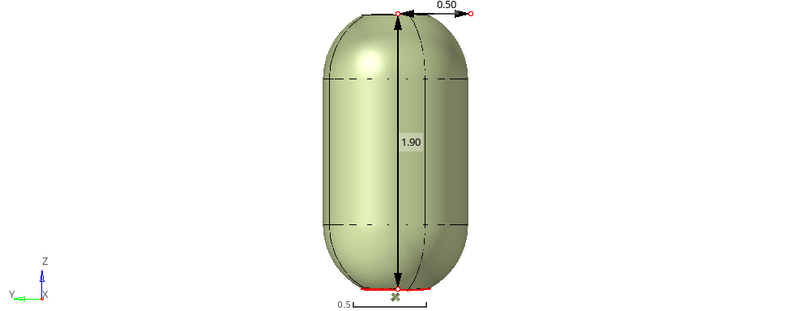

# General Model Overview – Cryogenic LH₂ Tank

This directory provides a visual reference and supporting documentation for the **general cryogenic LH₂ tank model** used in this thesis. The included image illustrates the base structural configuration before any laminate or topology optimization.

> _Figure: Rendered view of the unoptimized baseline composite LH₂ tank._

## ✅ Key Assumptions

The general model is based on the following assumptions consistent with the structural and thermal requirements of cryogenic propellant storage:

- **Geometry**: A cylindrical tank with hemispherical end domes and holes cut on either end. Total length is 1.9 m, width is 1.0 m, and end holes are 0.44 m in diameter.
- **Boundary Conditions**: Fixed base support in all directions on the thick steel plates covering the end holes. Internal pressure applied.
- **Factor of Safety**: Designed with a minimum FoS of **1.5** for structural integrity.
- **Loading**:
  - **Internal pressure**: Representative of LH₂ propellant tank pressures, with FOS of 1.5, 0.375 MPa is applied.
  - **Thermal gradient**: Simulating insulation and LH₂ thermal transfer conditions across insulation to material.

## 🧪 Materials Used

- **Composite Shell**:
  - Material: *Toray T700GC/epoxy*
  - Layup: Symmetric, quasi-isotropic laminate unless otherwise stated
- **Hole Covering**:
  - Material: *Engineering steel*
- **Insulation**:
  - Type: *Aerogel insulating foam*
  - Moderately dense (0.48 g/cm³) and evenly thick (5 cm) between inner shell and composite, used to calculate the approximate thermal transfer between the fuel and material. After the estimated approximate time in tank (2 hours), the material will reach -119.5 ◦C.

## 📎 Notes

- This model serves as a geometric and structural **reference configuration** for all optimization steps.
- The image may be used in presentations, reports, or documentation to visually anchor the baseline design.
- Mesh is made extremely fine (65,000 elements) for accuracy while not being so much to be overly expensive for computation.

## 🔗 Related Thesis Sections

Refer to:
- **Chapter 2: Model Formulation and Approach**

---

